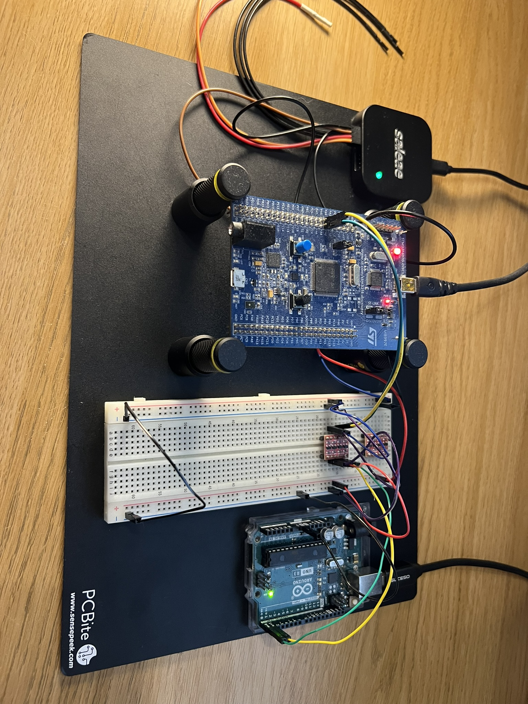

# STM32f407xx Drivers

This repository houses GPIO, I2C, SPI and UART drivers for the stm32f407xx microcontroller. These drivers include APIs for interrupt based and blocking style send and recieve functions.
The drivers were tested by myself using a logic analyser and a series of arduino scripts to act as another communication device. An example setup can be seen in the image below.



The code here was all written by myself apart from some exercises which were completed as part of the udemy course "(MCU1) Learn bare metal driver development using Embedded C" by Kiran Nayak (which I highly recommend). 
The drivers are not necessarily complete however functionally all the features I was looking to learn have been added. I've documented many of the learnings from this project in the section below.


# Microcontroller Learnings

Concepts and tricks that I learnt whilst writing the drivers for the stm32f47xx microcontroller.

- [Volatile Keyword](#volatile-keyword)
- [Danger of Static Variables](#danger-of-static-variables)
- [Enabling Clocks](#enabling-clocks)
- [Pre-processor Directives and Operator Precedence](#pre-processor-directives-and-operator-precedence)
- [Header file documentation](#header-file-documentation)
- [Do while zero condition macros](#do-while-zero-condition-macros)
- [IRQ Implementation and Startup Files](#irq-implementation-and-startup-files)
- [Setting the memory of structs](#setting-the-memory-of-structs)
- [Taking care when incrementing pointers](#taking-care-when-incrementing-pointers)

## Volatile Keyword

When compiling code with an optimistation level greater than 0, variables that **change** but are not given the volatile keyword will not be checked for changes during runtime. You **must** use the volatile keyword for a variable value that undergoes changes.

The compiler does this since reading values from memory is time consuming, so when set to a higher optimistion value the compiler skips the step of re-reading the value.

```c
#include <stdint.h>

#define HARDWARE_COUNTER_ADDRESS	(0x50003004U)

int main() {
	int volatile *hardware_counter = (int*) HARDWARE_COUNTER_ADDRESS;
	
	while(1)
	{
		if (*hardware_counter > 6)
		{
			return 1;
		}
	}
}
```

In this example, the hardware has a counter value that will increase by itself without the software necessarily knowing the value has changed. By including the volatile keyword, the compiler will always check the latest value of that variable. 

## Danger of Static Variables

Some functions may define variables with the static keyword. The static keyword in this usecase allocates the memory for this variable in
a static memory location rather than in automated memory allocation. This means that the variable will maintain its value through different
invocations of the function.

```c
void I2C_ApplicationEventCallback(I2C_Handle_t *pI2CHandle, uint8_t AppEv) {

	static uint8_t commandCode = 0;
	static uint8_t cnt = 0;
	
	commandCode++;
	cnt++
}
```

Both these variables will keep their value and not be reinitaited to 0. However, statics can be dangerous in threaded applications since
many threads may attempt to access the variables at once leading to race conditions and potential for unpredicatable behaviour.

## Enabling Clocks

Enabling clocks is as simple as picking the correct register and then later enabling the bits necessary using an OR/AND operator or a bit mask.

```c
#include<stdint.h>

#define RCC_BASE_ADDR              0x40023800UL

#define RCC_CFGR_REG_OFFSET        0x08UL

#define RCC_CFGR_REG_ADDR          (RCC_BASE_ADDR + RCC_CFGR_REG_OFFSET )

#define GPIOA_BASE_ADDR            0x40020000UL

int main(void)
{
	uint32_t *pRccCfgrReg =  (uint32_t*) RCC_CFGR_REG_ADDR;

	// Configure the RCC_CFGR MCO1 bit fields to select HSI as clock source
	*pRccCfgrReg &= ~(0x3 << 21); //clear 21 and 22 bit positions

	//Configure MCO1 prescaler
	*pRccCfgrReg |= ( 1 << 24); // This would divide the clock by 5.
	*pRccCfgrReg |= ( 1 << 25);
	*pRccCfgrReg |= ( 1 << 26);
}
```

This code configures the HSI clock as the MCU’s clock

## Pre-processor Directives and Operator Precedence

The use of brackets is important in pre-processor directives since in a macro, the parameters are replaced into the macro in place. This has little effect on something like a memory address in the example below but is good practise regardless.

```c
/*
 * Define the base addresses for AHBx and APBx Peripheral busses.
 */

#define PERIPH_BASEADDR				0x40000000U // Peripheral busses Base Address.
#define APB1PERIPH_BASEADDR			PERIPH_BASEADDR // APB1 Peripheral bus Base Address.
#define APB2PERIPH_BASEADDR			0x40010000U // APB2 Peripheral bus Base Address.
#define AHB1PERIPH_BASEADDR			0x40020000U // AHB1 Peripheral bus Base Address.
#define AHB2PERIPH_BASEADDR			0x50000000U // AHB2 Peripheral bus Base Address.

/*
 * Base Addresses for all peripherals used in these drivers.
 * NOTE: This list of peripherals is incomplete, only necessary
 * peripherals are included.
 */

#define SPI1_BASEADDR				(APB2PERIPH_BASEADDR + 0x3000)
#define SPI2_BASEADDR				(APB1PERIPH_BASEADDR + 0x3800)
#define SPI3_BASEADDR				(APB1PERIPH_BASEADDR + 0x3C00)
```

However, in an example like the square root macro, operator precedence is very important.

```c
#define SQR(x) (x*x) // Poorly defined macro..

int main()
{
    int a, b=3;
    a = SQR(b+5);      // This translates to SQR(3+5*3+5) which gives 23, not the expected 64.
    printf("%d\n",a);
    return 0;
}
```

## Header file documentation

Documentation within the function prototype in the header file should tell the function user what the function does and how to use it. In-line code documentation should go in the source file and leave notes to anyone maintaining the codes logic on how it works. Documenting like in the example below from stm32f407xx_gpio_driver also allows for auto generating documentation.

```c
/******************************************************************************
 * Initialisation function that configures a GPIO Pin based on the parameters
 * of the GPIOHandle structure.
 *
 * @param *pGPIOHandle A pointer a GPIO_Handle_t structure that is contains
 * 						the desired configuration for the GPIO Pin.
 ******************************************************************************/
void GPIO_Init(GPIO_Handle_t *pGPIOHandle);
```

## Do while zero condition macros

If theres ever a need to perform two or more actions in a macro, a do while zero condition macro allows for this. See the example below that sets and then clears a register value.

```c
#define GPIOA_REG_RESET()			do{ (RCC->AHB1RSTR |= (1 << 0)); (RCC->AHB1RSTR &= ~(1 << 0)); }while(0) // Set then reset.
```

## IRQ Implementation and Startup Files

The startup file for the microcontroller has weak defintions of functions that are overwritten by any other function with the same name. It is up to the developer to write a function specific to their application to handle this interrupt should it occur.

```c
	//startup_stm32f407vgtx.s
	.weak	EXTI0_IRQHandler
	.thumb_set EXTI0_IRQHandler,Default_Handler

	.weak	EXTI1_IRQHandler
	.thumb_set EXTI1_IRQHandler,Default_Handler

	.weak	EXTI2_IRQHandler
	.thumb_set EXTI2_IRQHandler,Default_Handler

	.weak	EXTI3_IRQHandler
	.thumb_set EXTI3_IRQHandler,Default_Handler
```

Also included in the startup file is a section that copies the memory address of the handler function and put it in the correct location in the interrupt and event vector table!

```c
g_pfnVectors:
  .word _estack
  .word Reset_Handler
  .word NMI_Handler
  .word HardFault_Handler
  .word	MemManage_Handler
  .word	BusFault_Handler
  .word	UsageFault_Handler
  .word	0
  .word	0
  .word	0
  .word	0
  .word	SVC_Handler
  .word	DebugMon_Handler
  .word	0
  .word	PendSV_Handler
  .word	SysTick_Handler
  .word	WWDG_IRQHandler              			/* Window Watchdog interrupt                                          */
  .word	PVD_IRQHandler               			/* PVD through EXTI line detection interrupt                          */
  .word	TAMP_STAMP_IRQHandler        			/* Tamper and TimeStamp interrupts through the EXTI line              */
  .word	RTC_WKUP_IRQHandler          			/* RTC Wakeup interrupt through the EXTI line                         */
  .word	0                            			/* Reserved                                                           */
  .word	RCC_IRQHandler               			/* RCC global interrupt                                               */
  .word	EXTI0_IRQHandler             			/* EXTI Line0 interrupt                                               */
  .word	EXTI1_IRQHandler             			/* EXTI Line1 interrupt                                               */
  .word	EXTI2_IRQHandler             			/* EXTI Line2 interrupt                                               */
  .word	EXTI3_IRQHandler             			/* EXTI Line3 interrupt                                               */
```

## Setting the memory of structs

When initialising structs in the method used in the snippet below, the values of the struct can be set to random values.

```c
GPIO_Handle_t GpioLed, GpioBtn;
```

One mechanism of countering the random allocation is to purposely set the memory to 0 using the memset function.

```c
GPIO_Handle_t GpioLed, GpioBtn;
memset(&GpioLed, 0, sizeof(GpioLed));
memset(&GpioBtn, 0, sizeof(GpioBtn));
```

## Taking care when incrementing pointers

Initially, I had incremented a uint32_t pointer by a uint8_t valued multiplied by 4 since I had assumed that the types should be the same to increment correctly.

```c
// 4x since iprx is of type uint8_t and we need to increment a uint32_t.
// Deference the corresponding priority register and set the correct bits
*(NVIC_PR_BASE_ADDR + (4 * iprx)) |= (IRQPriority << shift_amount);
```

This was incorrect since a uint32_t pointer when incremented by 1 is actually a jump to the next uint32_t memory address i.e 0x50002000 pointer + 1 becomes 0x50002004. Therefore I had to remove the *4 to remove the bug from my code.

```c
// Deference the corresponding priority register and set the correct bits
*(NVIC_PR_BASE_ADDR + (iprx)) |= (IRQPriority << shift_amount);
```
